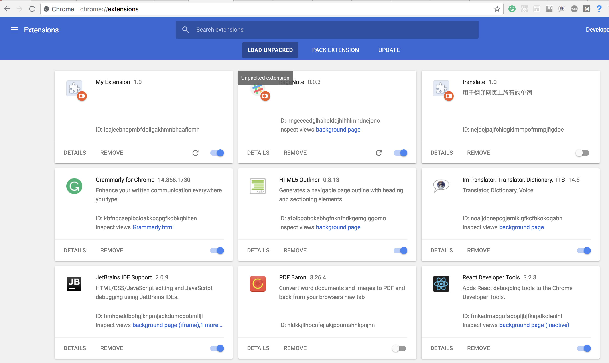

  

> logo designed by [zuurw](https://github.com/zuurw)

## What does it do ?
When you brower a webpage, you may hava some ideas and 
want to wirte some notes.

But where do you make note? notebook or you blog?
It may not be a good choose.

This project is a Chrome Extenxion. When you browser
some webpage, it will insert a bookemark to you page.

you can write you note colse to the webpage.

## How to install ?

- Install from [Chrome store (totally free)](https://chrome.google.com/webstore/detail/pagenote/emdjokmfeidbfldcdhckhpkcfiiekohl/related)

- Or download [last release \(zip file)](https://github.com/saltfish666/pageNote-Chrome/releases),
unzip it, and upload to Chrome.

- If you are blocked to google.com, you can follow next step and install it by youself

## Is it safe?
All source code is showed in this project.
If you doubt it may different with Chrome intall package,
you can compile soucre code and install it by youself.

- step1: clone my project.

`git clone git@github.com:saltfish666/pageNote-vue.git`

- step2: compile it: (you should install `npm` first)

in current dir:

  `npm run build`

- step3: unpack to chrome
open chrome and go to `chrome://extensions/`
click `LOAD UNPACKED` and choose current folder.
then you will see this extension.

