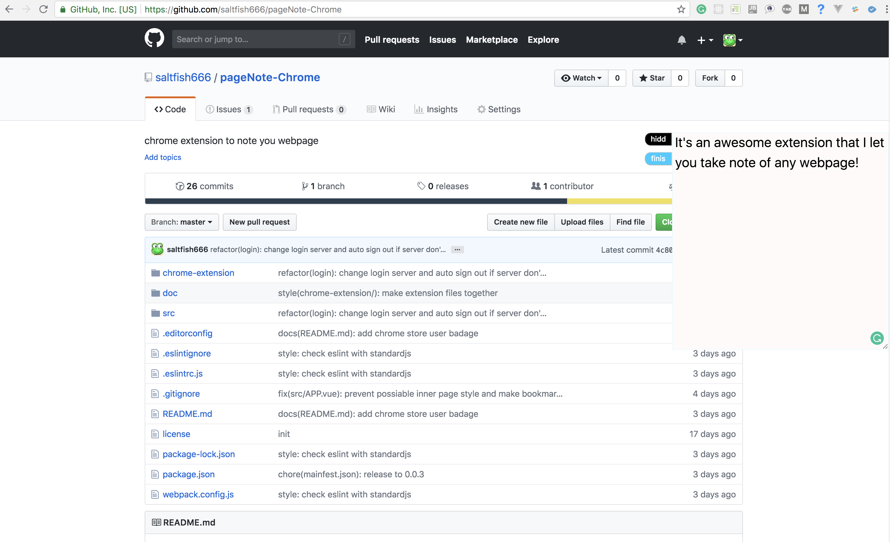

## what does it do ?
When you brower a webpage, you may hava some ideas and 
want to wirte some notes.

But where do you make note? notebook or you blog?
It may not be a good choose.

This project is a Chrome Extenxion. When you browser
some webpage, it will insert a bookemark to you page.

you can write you note colse to the webpage.

## how to install ?
Due to I do not have a interal bankcard, I can 
not upload it to Chrome Store. You have to install
it by a self.

- step1: clone my project.

`git clone git@github.com:saltfish666/pageNote-vue.git`

- step2: compile it: (you should install `npm` first)

in current dir:

  `npm run build`

- step3: unpack to chrome
open chrome and go to `chrome://extensions/`
click `LOAD UNPACKED` and choose current folder.
then you will see this extension.

