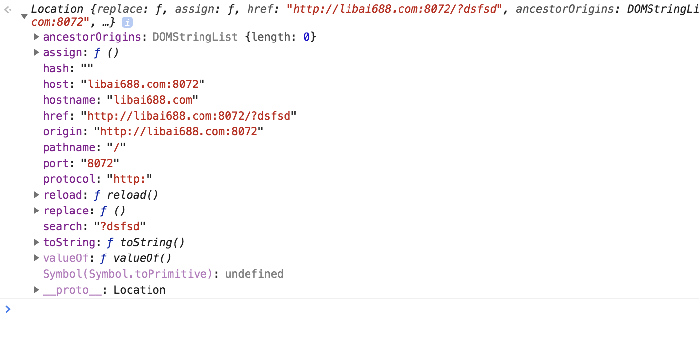

登录状态由token确定，存储在插件的localStorage

https网页不能对http访问，所以我还要升级自己的网站

尝试用后台转发ajax请求，但是[chrome sync](https://stackoverflow.com/questions/20077487/chrome-extension-message-passing-response-not-sent/20077854#20077854)
一脸蒙蔽

 - domain: window.location.host,
 - path: window.location.pathname
 
 这是我的键
 
 
